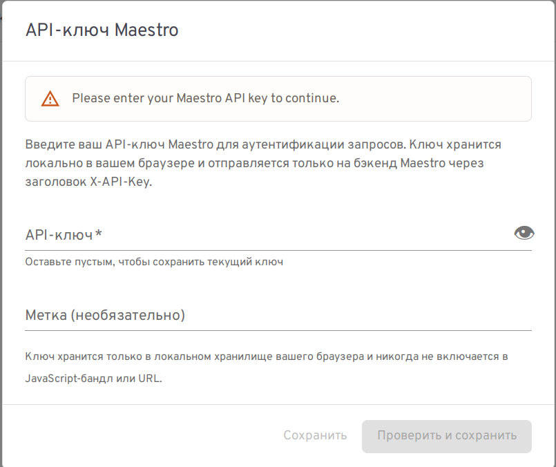
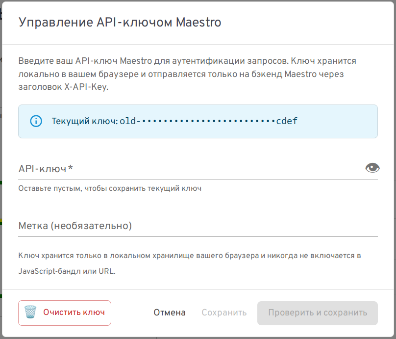

# Механизмы защиты maestro

## Сеть

`maestro` содержит два интерфейса:

- `WEB-интерфейс` пользователя;
- `REST-интерфейс` для выполнения операции с узлами кластера и кластера в целом.

При выполнении операций с компьютера, на котором запущен браузер клиента производится запрос к REST-интерфейсу по протоколу `HTTP`.
Этот протокол не зашифрован и может быть легко перехвачен злоумышленником в каналах передачи данных.
Эту проблему можно решить двумя способами:
  
- Разворачивание `REST-интерфейса` в `POD`е `kubernetes-кластера`. В этом случае необходимо поднять на сервере поддерживающий `REST`-интерфейс `HTTPS Proxy-сервер`, обеспечивающий шифрацию данных при передаче запроса к REST-интерфейсу (например `nginx`).
- Разворачивание `REST-интерфейса` и браузер клиента на одном компьютере и передавать запросы по локальному интерфейсу на `URL` `localhost` (`127.0.0.1`).

По простоте реализации и уровню защищенности предпочтителен второй способ. В этом случае уровень защиты решения совпадает с уровнем зашиты рабочего места администратора. Высокий уровень защиты рабочего места администратора обеспечить намного проще.

<!--
Здесь и далее будет рассмотрен вариант запуска WEB и REST интерфейса на компьютере администратора системы как в при разворачивании в виде `RPM-пакетов`, так в виде `docker-образа`.
-->

## Авторизация

Для авторизации используется `API-Key` нескольких типов. 
Список ключей описывается в файле конфигурации `maestro_api/.env` в переменной `MAESTRO_API_KEYS`.
К каждому ключу привязан набор параметров:

- `scopes` - массив типов допустимых запросов:
    * `read` - допустимы запросы на чтение (GET, HEAD, OPTIONS);
    * `write` - допустимы запросы на запись POST, PUT, PATCH, DELETE;
    * `admin` - допустимы оба типа запросов.
- `rate_limit_per_minute` - число запросов в минуту;
- `expires_at` - дата окончания действия ключа.

Пример описания ключей:
```json
[
  {
    "key": "a1b2c3d4e5f6g7h8i9j0k1l2m3n4o5p6",
    "scopes": ["read", "write"],
    "rate_limit_per_minute": 60
  },
  {
    "key": "old-rotating-key-1234567890abcdef",
    "scopes": ["read"],
    "rate_limit_per_minute": 10,
    "expires_at": "2026-07-01T00:00:00Z"
  },
  {
    "key": "super-admin-key-abcdefghijklmnopqrst",
    "scopes": ["admin"],
    "rate_limit_per_minute": 1000
  }
]
```

Параметр `rate_limit_per_minute` при запуске  под несколькими worker'ами (gunicorn -w N) лимит устнавливается на каждый worker и фактически умножается на число worker'ов. Кроме этого он сбрасывается на рестарте API-сервера.

Список `API-ключей` хранится только на `API-сервере` в переменной `MAESTRO_API_KEYS` `.env` файла.
Данный файл имеет вид:
```sh
MAESTRO_API_KEYS='...'
```
На стороне браузера клиента при отображении интерфейсов проверяется инициализирована ли переменная, хранящая значение `API_KEY`.
Если нет - отображается модальное окно для ввода значения ключа.



После ввода ключа он сохраняется в хранилище браузера.

Для смены ключа кликните на иконку ключа в строке заголовка страницы maestro справа .
Отображается модальное окно для смены или отмены значения ключа:



Поддержка вводимого на стороне клиента `API-ключа` обеспечивает высокий уровень защиты в том числе и от кросс-сайтовых атак.
При передаче ключа по недоверенным сетям необходима смена протокола передачи с `http` на `https` иversy организация доступа к API-серверу через `reversy-proxy` с поддержкой протокола `https`.


## CORS (Cross-Origin Resource Sharing)

Механизм `CORS` обеспечивает ограничение доступа к REST-интерфейсу на стороне браузера.

Перед тем как послать основной запрос (`GET`, `POST`, ...) к ресурсу на REST-API сервере браузер посылает запрос 
`OPTIONS` включая в заголовки запроса поле 
```http
Origin: <Origin_Host>:<Origin_Port>
```
Где `<Origin_Host>`, `<Origin_Port>` - домен (или IP) узла и порт откуда производится запрос.

`REST-API` сервер получив запрос `OPTIONS` проверяет имеет ли право указанный в поле `Origin` `URL` получать данные с сервера.
Если адресат запроса в списке разрешенных, `REST-API` сервер возвращает ответ с кодом `200`, включая в него поле
```http
Access-Control-Allow-Origin:  <Origin_Host>:<Origin_Port>
```
Если браузер в ответ на запрос `OPTIONS` получает ответ `200` с полем `Access-Control-Allow-Origin`, то он  делает основной запрос `GET`, `POST`, ...
Если в ответ на запрос `OPTIONS` нет поля `Access-Control-Allow-Origin` браузер не посылает основной запрос. 
Клиент браузера в этом случае не получает запрашиваемую информацию. 

Список разрешенных `URL` с которых возможно получение запросов на стороне `REST` API сервера `maestro`  указывается в переменной среды `MAESTRO_CORS_ORIGINS`. 
В ней указывается либо одно значение либо несколько через запятую.
По умолчанию значение `MAESTRO_CORS_ORIGINS` устанавливается в `localhost`.
При значении `localhost` или `127.0.0.1` значение `MAESTRO_CORS_ORIGINS` устанавливается в
```
    "http://localhost",
    "http://127.0.0.1",
    "http://localhost:4466",
    "http://127.0.0.1:4466",
```
обеспечивая доступ со всех возможных `URL` локального `frontend`а `maestro`.
Данный режим удобен при работе в самом защищенном варианте когда `frontend` и `backend` maestro находятся на одном 
компьютере администратора и доступны только по локальному интерфейсу (и недоступны из других сетей).
В этом случае переменная среды `MAESTRO_API_HOST` должна иметь значение:
```sh
MAESTRO_API_HOST=127.0.0.1
```

Если необходимо обеспечить доступ к `REST-API` серверу с нескольких компьютеров сети, то значение переменной 
 `MAESTRO_API_HOST` необходимо установить либо в:
```sh
MAESTRO_API_HOST=<IP-адрес-сетевого-интерфейса>
```
либо для всех интерфейсов API-сервера в
```sh
MAESTRO_API_HOST=0.0.0.0
```
а в переменной `MAESTRO_CORS_ORIGINS` указать URL, с которых допустим доступ к REST-API серверу. Например:
```sh
MAESTRO_CORS_ORIGINS='http://10.0.0.87:4466, http://localhost:4466'
```
В данном режиме возможно организовать несколько рабочих мест с доступом к одному `REST-API` серверу `masetro`.
С одного рабочего места с `API-KEY` с
```
"scopes": ["admin"]
```
обеспечить администрирование кластера.
С остальных с `API-KEY` с
```
"scopes": ["read"]
```
просматривать состояние узлов кластера.

> При совместном использовании `API сервера maestro` необходимо поднять `reverse proxy`, обеспечивающий доступ к `API серверу` по защищённому протоколу `https`. Желательно это сделать через `docker compose` (`podman-compose`) или `kubernetes POD` включающий оба сервиса, чтобы закрыть прямой доступ к `API серверу maestro`. Можно также в качестве альтернативы на уровне ядра Linux настроить фильтрацию пакетов.

Использование механизма `CORS` в браузерах обеспечивает запрет доступа клиентов к REST-API серверу по информационным запросах `GET`, `POST`, `PUT`, ..., но он не закрывает доступ при использовании других `http-клиентов`: `curl`, `postmen`, ...
Злоумышленник получив `REST-API-KEY` сервера `maestro` может получить доступ к нему.
Чтобы этого избежать в сервере `maestro` реализованы дополнительный механизм защиты.
В файле `.env` переменная `MAESTRO_API_WHITELIST` может содержать список IPv4 или IPv6 адресов (по умолчанию `127.0.0.1`) с масками сети с которых допустим доступ к REST API.
API-сервер определяет с какого адреса пришёл запрос и если это адрес не входит в список  `MAESTRO_CORS_ORIGINS`,
то возвращается ответ с кодом `403` и сообщением:
```http
IP not allowed IP {client_ip} is not in the list of trusted origins
```
Таким образом злоумышленник для доступа к `REST-API` сервера `maestro` должен получить:
- `MAESTRO_API_KEY`;
- доступ к узлам, указанным в `MAESTRO_API_WHITELIST` сервера.

`REST API` сервер по полю `X-Forwarded-For` определяет IP адрес клиента, работающего через `proxy` сервер.
Злоумышленник может подделать это поле и если это поле не формируется `proxy` сервером при угадывании IP получить доступ к с
`REST-API` серверу. Чтобы этого не произошло обязательно формируйте поле `X-Forwarded-For` на proxy-сервере.
При использовании `nginx` укажите в файле конфигурации:
```nginx
proxy_set_header X-Forwarded-For $proxy_add_x_forwarded_for;
```
## Дополнительная защита

В ответ на `REST-запрос` добавляются заголовки.

- `Content-Security-Policy: "default-src 'none'; frame-ancestors 'none'; form-action 'none'; base-uri 'none'; object-src 'none'"`

    Где:

    * `default-src` - Запретить загрузку любых ресурсов по умолчанию.
    * `frame-ancestors` - Защита от Clickjacking (запрет встраивания в iframe).
    * `form-action` - Запрет отправки форм.
    * `base-uri` - Запрет изменения базового URI документа.
    * `object-src` - Запрет плагинов (Flash, PDF и т.д.).

- `X-Frame-Options: DENY` - Clickjacking (Legacy защита для старых браузеров).

- `X-Content-Type-Options:nosniff ` - XSS: Запрет MIME-sniffing (браузер не должен угадывать тип контента).  Особенно важно для JSON, чтобы его не интерпретировали как HTML/JS.

- `Cross-Origin-Opener-Policy::same-origin ` - XS-Leaks: Изоляция контекста. COOP: Гарантирует, что окно не будет иметь доступа к другим окнам того же origin, если они не имеют того же COOP..

- `Cross-Origin-Embedder-Policy: require-corp` -COEP: Требует, чтобы все загружаемые ресурсы имели явные заголовки CORP/CORS.

- `Cross-Origin-Resource-Policy']: same-origin` - CORP: Дополнительно защищает ресурсы от чтения другими origin без явного разрешения..

- `X-Content-Type-Options']: nosniff` -  Для ответов типа `application/json` явное указание типа контента для предотвращения XSS через MIME-конфузию.

- `Strict-Transport-Security': 'max-age=31536000; includeSubDomains'` - XSS: HTTP Strict Transport Security (HSTS).  Принудительное использование HTTPS (отключаем в debug-режиме для локальной разработки).

## Защита от CSRF  (Cross-Site Request Forgery / Межсайтовая подделка запроса) 

Подробная информация о `CSRF` атаке описана [здесь](./CSRF_Attacks.md).

Так `frontend` `maestro` не использует `cockie`,  а
для идентификации пользователя `maestro-API`  сервер требует наличия в запросе заголовка  `X-API-Key`, то атака типа `CRSF` не пройдёт.

Запросы с заголовками `X-API-Key`  **НЕ ПОДВЕРЖЕНЫ** `CSRF`, так как браузеры не могут подделать кастомные заголовки  в межсайтовых запросах без прохождения `CORS preflight` (запрос  типа `OPTIONS`).

Передача ключа через query-параметр `?api_key=...` уязвима к `CSRF`,  так как браузер автоматически добавит его при переходе по ссылке.
Но `maestro-API`  сервер  не поддерживает установку `API-KEY` при передаче его через параметры.
Таким образом этот способ обхода защиты для `maestro` также неприменим.

## Способы развёртывание решения

Как было уже описано выше разворачивать решение можно двумя способами:  

- Развёртывание `REST`, `WEB` интерфейсов и браузер клиента на одном компьютере и передавать запросы по локальному интерфейсу на `URL` `localhost` (`127.0.0.1`).
- Развёртывание `REST-интерфейса` на отдельном сервере, в `docker`, `podman` контейнере или в `POD`е `kubernetes-кластера`. В этом случае необходимо поднять на сервере поддерживающий `REST`-интерфейс `HTTPS Proxy-сервер`, обеспечивающий шифрацию данных при передаче запроса к REST-интерфейсу (например `nginx`). `WEB` интерфейс может быть либо на том же сервере, что и REST-интерфейс, либо на отдельном сервере или контейнере. 
В обоих случаях доступ к `WEB` интерфейсу производится через удаленный доступом из браузера клиента.

### Общие принципы развертывания WEB и REST интерфейсов


#### Развёртывание сервиса headlamp с плагином maestro

Для развёртывания сервиса `headlamp` установите пакет `headlamp`:  
```sh
apt-get install headlamp
```

В пользователе от имени которого запускается `headlamp` сервис:

- поднимите `headlamp` сервис:
```sh
$ systemctl --user enable --now headlamp
```

- создаёте каталог 
```sh
# mkdir /usr/share/headlamp/plugins/maestro
```
- поместитк туда файлы и каталоги:
    * файл `main.js` - минифицированный код плагина `maestro`;
    * каталог `locales` - каталог локализации 
    * файл `package.json` - файл описания `npm` пакетов плагина `maestro`

При отладке это могут быть символические ссылки на отлаживаемый код:
``` 
lrwxrwxrwx 1 root root 59 июн 19 11:11 locales -> /.../maestro/plugin/maestro/dist/locales/
lrwxrwxrwx 1 root root 58 июн 19 11:10 main.js -> /.../maestro/plugin/maestro/dist/main.js
lrwxrwxrwx 1 root root 58 июн 22 17:52 package.json -> /.../maestro/plugin/maestro/package.json
```

#### Развёртывание REST API сервера

В отладочном режиме REST API сервер запускается из каталога `.../maestro_api` скриптом `.../scripts/start.sh`.


### Развёртывание `REST`, `WEB` интерфейсов на одном сервере

Как было описано выше это самый защищенный режим развертывания, но он позволяет организовать только одно рабочее место администратора.
Файл `.env` каталога `.../maestro_api` может выглядеть следующим образом:
```sh
# MAESTRO_API_PORT=5000
# MAESTRO_API_DEBUG=true

MAESTRO_CORS_ORIGINS=http://127.0.0.1:4466
MAESTRO_API_WHITELIST=127.0.0.1

export MAESTRO_API_KEYS='[
  {
    "key": "super-admin-key-abcdefghijklmnopqrst",
    "scopes": ["admin"],
    "rate_limit_per_minute": 1000
  }
]'

# MAESTRO_TALOS_COMMAND_TIMEOUT_SECONDS=30
# MAESTRO_NMAP_COMMAND_TIMEOUT_SECONDS=120
# MAESTRO_PORT_CHECK_TIMEOUT_SECONDS=3
```
При необходимости можно изменить `TIMEOUT`ы ожидания событий.

Если изменено значение порта по умолчанию `MAESTRO_API_PORT` с `5000` на другое значение, 
то необходимо создать файл конфигурации плагина `maestro` `/usr/share/headlamp/plugins/maestro/config.json`:
```json
{
  "MAESTRO_API_URL": "http://127.0.0.1:<port>"
}
```
где <port> - номер порта указанного в переменной `MAESTRO_API_PORT` на котором слушает REST API сервер по локальному интерфейсу.


### Развёртывание `REST`, `WEB` интерфейсов на разных серверах, контейнерах или POD'ах

По умолчанию сервис `headlamp`  запускается на порту `4466` интерфейса `127.0.0.1`.
Если Вы планируете разделять WEB-интерфейс maestro между несколькими пользователями, то необходимо его поднять на другом сетевом интерфейсе.
Допустим мы планируем поднять его на порту `14466` адреса `10.162.108.248` сетевого интерфейса `eth0`.
Для его в файле `/usr/lib/systemd/user/headlamp.service` необходимо изменить адрес и порт:  
```
...
ExecStart=/usr/bin/headlamp-server \
    -listen-addr 10.162.108.248 \
    -port 14466 \
    -html-static-dir /usr/share/headlamp/frontend \
    -plugins-dir /usr/share/headlamp/plugins
...
``` 
и перезапустить сервис:
```sh
systemctl --user daemon-reload
systemctl --user restart headlamp
```

REST API интерфейс поднимкм на пору `5000` сервера `10.162.108.249`.
Файл конфигурации плагина `maestro` `/usr/share/headlamp/plugins/maestro/config.json` на WEB-сервере `10.162.108.248` будет выглядеть следующим образом:
```json
{
  "MAESTRO_API_URL": "http://10.162.108.249:5000"
}
```

Файл конфигурации`.env` REST API на сервере `0.162.108.249` будет выглядеть следующим образом:
```sh
# MAESTRO_API_PORT=5000
# MAESTRO_API_DEBUG=true

MAESTRO_API_HOST=10.162.108.249
MAESTRO_CORS_ORIGINS=http://10.162.108.248:14466
MAESTRO_API_WHITELIST=10.162.108.248/32

export MAESTRO_API_KEYS='[
  {
    "key": "a1b2c3d4e5f6g7h8i9j0k1l2m3n4o5p6",
    "scopes": ["read", "write"],
    "rate_limit_per_minute": 60
  },
  {
    "key": "old-rotating-key-1234567890abcdef",
    "scopes": ["read"],
    "rate_limit_per_minute": 10,
    "expires_at": "2026-07-01T00:00:00Z"
  },
  {
    "key": "super-admin-key-abcdefghijklmnopqrst",
    "scopes": ["admin"],
    "rate_limit_per_minute": 1000
  }
]'

# MAESTRO_TALOS_COMMAND_TIMEOUT_SECONDS=30
# MAESTRO_NMAP_COMMAND_TIMEOUT_SECONDS=120
# MAESTRO_PORT_CHECK_TIMEOUT_SECONDS=3

```


## Итоговый анализ кода на предмет защиты от атак

Важно честно очертить модель угроз. `maestro_api` — это **JSON-API, аутентифицируемый по заголовку** (`X-API-Key`), а не веб-приложение с cookie-сессиями и HTML-страницами. Поэтому реально значимых для этого API cross-site-мер три: **аутентификация по API-ключу**, **CORS** и **IP-whitelist**. Остальные заголовки (CSP, `X-Frame-Options`, COOP/COEP/CORP) — это дешёвая «защита в глубину» (defense in depth): они не вредят, но защищают браузерный *документ*, а этот сервис документов не отдаёт. Реальная поверхность XSS/clickjacking/XS-Leaks/postMessage находится во **фронтенде-плагине**, который отдаёт Headlamp, и данным сервисом не покрывается.

| Тип атаки | Применимость к API | Реализация / комментарий |
| :--- | :--- | :--- |
| **API-key аутентификация** | ✅ Ключевая мера | Каждый запрос требует `X-API-Key` (или `Authorization: Bearer`). Ключи сравниваются в постоянном времени (`hmac.compare_digest`), поддерживаются scopes (`read`/`write`/`admin`), лимит запросов и срок действия. Без валидного ключа — 401/403. Это главное, что защищает API. |
| **CORS** | ✅ Ключевая мера | `flask-cors` со строгим списком `origins`; wildcard `*` запрещён и роняет приложение на старте; `supports_credentials=False`. Один механизм, без ручного дублирования заголовков. |
| **IP-whitelist** | ✅ Ключевая мера | `MAESTRO_API_WHITELIST` — проверка IP клиента по маске подсети, независимая от CORS. Не в списке → 403 даже с валидным ключом. Замечание: доверять `X-Forwarded-For` можно только за доверенным reverse-proxy, иначе IP подделывается. |
| **CSRF** | ✅ Неприменимо by design | Авторизация — кастомный заголовок, а не cookie; ключ не принимается в URL. Cross-site браузер такой заголовок не поставит без preflight. Отдельная CSRF-защита не нужна (её код удалён как мёртвый). |
| **XSS** | ➖ Не поверхность этого API | API не отдаёт HTML/JS, всегда `application/json`. `CSP`/`nosniff` стоят как defense-in-depth, но реальная XSS-поверхность — во фронтенде (экранирование React, отказ от `dangerouslySetInnerHTML`), и она этим сервисом не закрывается. |
| **Clickjacking** | ➖ Не поверхность этого API | JSON нельзя осмысленно встроить в iframe. `X-Frame-Options: DENY` и `frame-ancestors 'none'` — defense-in-depth; фреймится UI Headlamp, а не этот API. |
| **XS-Leaks** | ➖ Не поверхность этого API | COOP/COEP/CORP — заголовки уровня *документа*; на JSON-ответе они инертны (defense-in-depth), а не «полная защита». |
| **postMessage** | ➖ Неприменимо | Ни API, ни плагин `postMessage` не используют. Если во фронтенде появится — обязательна проверка `event.origin` (это ответственность фронтенда, не API). |
