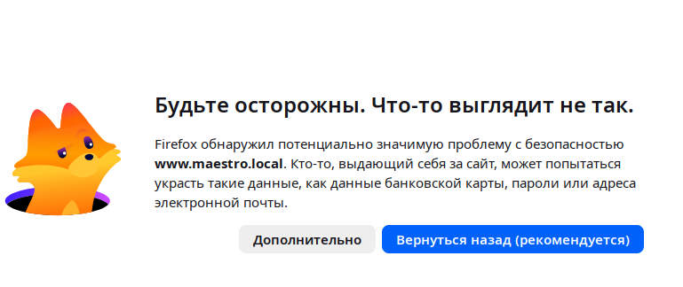
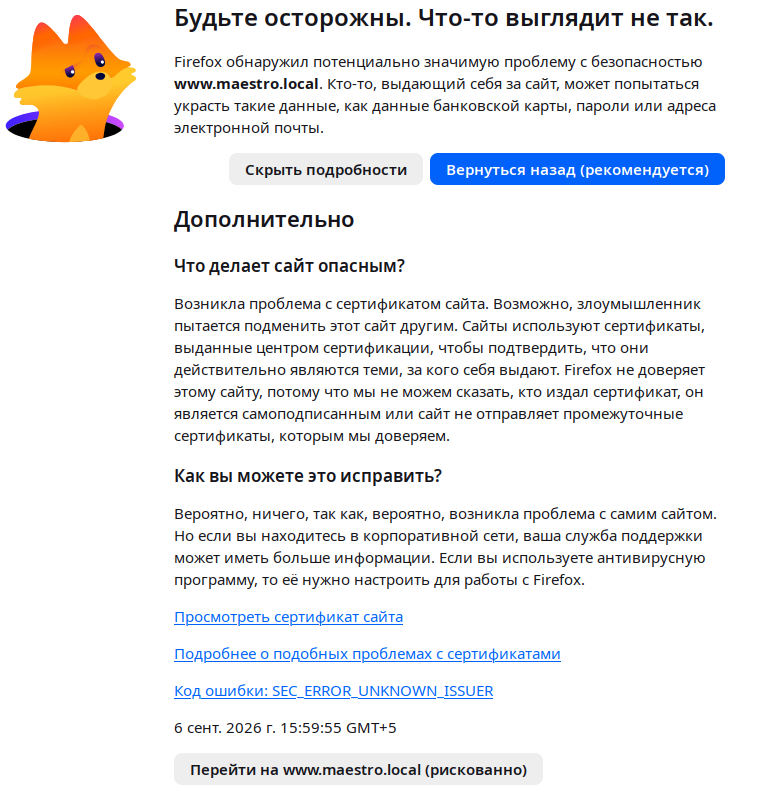

# Docker образ maestro-dev

Имя образа `altlinux.space/alt-orchestra-dev/maestro-dev`.

Образ содержит пакет `headlamp`, `frontend` и `backend` `maestro`.

## Dockerfile

URL: [Dockerfile](../Dockerfile)


## Переменные окружения

- `MAESTRO_API_HOST` - имя хоста или IP-адрес  на котором доступен REST API порт 5000. 
- `MAESTRO_API_KEYS` - JSON-строка описания API-ключей. Структура описана в документе [Secutity.md](Secutity.md) в разделе *Авторизация*.
- `MAESTRO_CORS_ORIGINS` - список `URL`'s (включая порты) которых возможен доступ к API-интерфейсу (URL содержащийся в строке адреса интерфейса браузера).
- `MAESTRO_API_WHITELIST` - список IP-адресов которых возможен доступ к API-интерфейсу (без указания портов).

## Контекст разворачивания

Docker образ вызывается от обычного пользователя. Вызов от суперпользователь (пока) не поддерживается.
Пользователь должен входить в группу `docker`.
Для вхождения в группу `docker` наберите команду
```sh
# usermod -aG docker <user>
```
и перевойдите в пользователя.

В данном документе описывается запуск образа через  `docker compose`. Запуск через `podman compose` (пока) не тестировалcя.
При вызове из `docker` должен быть установлен контекст `default`:
```sh
docker context use default
```
Пооверить состояние контекста можно командой:
```sh
docker context ls
```
``` 
NAME        DESCRIPTION                               DOCKER ENDPOINT                                ERROR
colima      colima                                    unix:///home/<user>/.colima/default/docker.sock   
default *   Current DOCKER_HOST based configuration   unix:///var/run/docker.sock ```
```

## Варианты разворачивания

Образ включает в себя оба компонента `maestro`:
- `maestro frontend` - плагин maestro, поддерживаюший в интерфейсе headlamp страницы для работы с kubernetes кластером и узлами Альт Орнестрации;
- `maestro API`- REST/API интерфейс, принимающий запросы от `maestro frontend`, выполняющий переданный запрос и возвращающий ему результат. 

Следует заметить, что при разворачивании кластера через `maestro API` он формирует в файле `~/.kube/config` контекст, описывающий кластер:
```yaml
- name: <имя_класткра>
  cluster:
    certificate-authority-data: ...
    server: <URL kube-apiserver или proxy>
  name: "3"
```
Этот контекст должен быть доступен в `maestro frontend`. Таким образов оба компонента должны функционировать в рамках одного контейнера. 

В зависимости от места запуска компонента `maestro API` варианты разворачивания могут быть следующие:
- `maestro API` разворачивается на компьютере администратора на локальном интерейсе `lo` (localhost=127.0.0.1) с доступом из браузера клиента только по локальному интерфейсу (максимально защищенный режим);
- `maestro API` разворачивается на компьютере администратора на одном или нескольких интерфейсов локальной сети с доступом из браузеров администратора и клиентов из локальной или внешней сети по протоколу `https`;
- `maestro API` разворачивается в кластере `kubernetes`.  

Таким образом ниже рассматриваются следующее дерево вариантов разворачивания:
<pre>
├── localonly  
│   └── bridge
├── localext
│   └── bridge
└── ext
</pre>
В рамках каждого варианта при необходимости рассматриваются возможные среды разворичивания: `docker`, `podman`, `kubernetes`.

Пользователи, работающие из браузера могут иметь различные права доступа: только на чтение, на чтение и запись. Это достигается раздачей им ключей с разрвчнами правами, сроком действия ключей и числу запросов в минуту к `maestro API`.

Все нижеприведенные варианты разворачивания располагаются в каталоге [/Docker/docker-composes/](../Docker/docker-composes/).
В режиме docker docker-сервисы поднимаются скриптом
[/Docker/docker-composes/maestro-docker-compose.sh](../Docker/docker-composes/maestro-docker-compose.sh):
<pre>
#!/bin/sh

function getProjectName() {
  ifs=$IFS;   IFS=/;set -- $(pwd);IFS=$ifs
  while [ $# -gt 0 -a "$1" != 'docker-composes' ]; do shift; done; shift
  ret=$1
  while [ $# -gt 1 ];  do shift; ret+="-$1";  done
  echo $ret
}

if [ $UID -eq 0 ]
then
  echo "Скрипт не может вызываться в пользователем с UID=0" >&2
  exit 1
fi
action=$1
case "$action" in
'up') action='up -d';break;;
'down') break;;
*) echo "Формат $0 up|down" >&2; exit 1
esac

export MAESTRO_API_USER=$USER
export MAESTRO_API_UID=$(id -u $MAESTRO_API_USER)
export MAESTRO_API_GID=$(id -g $MAESTRO_API_USER)
projectName=$(getProjectName)
docker compose -p $projectName $action
</pre>
Скрипт в каждом каталоге варианта имеет алиас на указанный скрипт.
Первым параметром передаются действия:
- `up` - поднять стек сервисов.
- `down` - опустить стек сервисов.

Скрипт:
- определяет имя запускающего пользователя, его `uid` и `git` и экпортирует их в переменных `MAESTRO_API_USER`, `MAESTRO_API_UID`, `MAESTRO_API_GID`;
- по катаалогу запуска формирует имя проекта;
- в зависимости от первого парамерта поднимает или опускает стек сервисов.

### Разворачивание Мaestro API и Мaestro frontend на компьютере администратора на локальном интерфейсе lo

#### Файл .env

Файл [.env](../Docker/docker-composes/localonly/bridge/docker/.env):
```yaml
MAESTRO_API_KEYS='[
  {
    "key": "scope-read-write",
    "scopes": ["read", "write"],
    "rate_limit_per_minute": 60
  },
  {
    "key": "scope-read-expired",
    "scopes": ["read"],
    "rate_limit_per_minute": 10,
    "expires_at": "2026-07-01T00:00:00Z"
  },
  {
    "key": "scope-superadmin-key",
    "scopes": ["admin"],
    "rate_limit_per_minute": 1000
  }
]'
MAESTRO_CORS_ORIGINS=http://127.0.0.1:4466,http://localhost:4466
MAESTRO_API_WHITELIST=127.0.0.1,172.0.0.0/8
```
Переменная `MAESTRO_API_KEYS` содержит пример описания трех `API-ключей` с различными правами доступа, временем действия и ограничениями 
числа обращений в минуту.

Переменная `MAESTRO_CORS_ORIGINS` содержит список `URL`'s с которых возможен доступ к API-интерфейсу из браузера.
Значения `http://127.0.0.1:4466`,`http://localhost:4466` определяют список URL по которым доступен `frontend` из браузера.

Переменная `MAESTRO_API_WHITELIST` определяет список IP-адресов с которых возможен доступ к API-интерфейсу из браузера и других сетевых приложений (`curl`, `podman`, ...).

#### Файл docker-compose.yml

Файл [docker-compose.yml](../Docker/docker-composes/net_overlay/docker-compose.yml):
```yaml
services:
  maestro:
    image: altlinux.space/alt-orchestra-dev/maestro-dev:latest
    ports:
      - 127.0.0.1:4466:4466
      - 127.0.0.1:5000:5000
    environment:
      MAESTRO_API_USER: $MAESTRO_API_USER
      MAESTRO_API_UID: $MAESTRO_API_UID
      MAESTRO_FRONTEBD_HOST: 0.0.0.0
      MAESTRO_API_HOST: 0.0.0.0
      MAESTRO_API_KEYS: $MAESTRO_API_KEYS
      MAESTRO_CORS_ORIGINS: $MAESTRO_CORS_ORIGINS
      MAESTRO_API_WHITELIST: $MAESTRO_API_WHITELIST
    volumes:
      - /home/$MAESTRO_API_USER/.maestro:/home/maestro/.maestro
      - /home/$MAESTRO_API_USER/.kube:/home/maestro/.kube
```
Внутренние порты `4466`(`frontend`) и `5000` (`REST/API`) контейнера пробрасываются на интерфейс `localhost` (`127.0.0.1`) `HOST`-компьютера.
Это позволяет закрыть доступ к этим интерфейсам из локальной и внешней сети.

Так как IP-адрес интерфейса контейнера может быть любым, то переменные `MAESTRO_FRONTEBD_HOST`, `MAESTRO_API_HOST` имеет значение `0.0.0.0`.

Значения переменных `MAESTRO_API_KEYS`, `MAESTRO_CORS_ORIGINS`, `MAESTRO_API_WHITELIST` импортируются из файла `.env

Значения переменных `MAESTRO_API_USER`, `MAESTRO_API_UID` формируются из переменных среды скриптом `maestro-docker-compose.sh`, описанном выше.

Каталоги: 
- `/home/maestro/.maestro` - каталог конфигурации для `Maestro`; 
- `/home/maestro/.kube` - каталог конфигурации для `kubernetes`
монтируются на каталоги 
- `/home/$MAESTRO_API_USER/.maestro`
- `/home/$MAESTRO_API_USER/.kube`
контейнера.

Так как API интерфейс в контейнере запускается с `uid=$MAESTRO_API_UID`, `gid=$MAESTRO_API_GID пользователя`, запустившего контейнер он имеет права на запись и чтение указанных аталогов.


> Возможны ситуации отсутствия доступа из docker-контейнеров к узлам кластера. Например когда узлы кластера развернуты в `virt-manager` и docker контейнеры запускаются на этом же компьютере. Обычно `virt-manager` блокирует трафик с узлов кластера по интерфейсу `virbr0` другим сетям (включая docker0) HOST-системы. Данная проблема решается удалением nft-правила в цепочке `guest_input` сети `libvirt_network`.  Определите командой   
```sh
# nft -a list chain ip libvirt_network guest_input
```
``` 
> номер правила в цепочке guest_input и удалите его командой
# nft delete rule ip libvirt_network guest_input handle <номмер правила>
```

### Pазворачивание с удаленным доступом из браузера клиента как админстратора так и остальных клиентов

При удалённом доступе пробрасывать внутренние http-порты `4466`, `5000` контейнера на интерфейс локальной сети нельзя, так как злоумеiленник имея досутп к локальном сети может прослушать TCP-пакеты локальной сети и определить `X-Api-Key` ключи, которые пользователи  передают API-серверу.

Для исключения этого варианта необходимо при удаленном доступе по локальной или внешней сети использовать защищенный https-протокол.

##### Файл docker-compose.yml

В этом случае в рамках стека сервисов, описанных в файле `docker-compose.yml` поднимается proxy-сервер `caddy`, который подключается к интерфейсам HOST-системы работая в режиме
```
network_mode: host
```

Файл [docker-compose.yml](../Docker/docker-composes/net_overlay/docker-compose.yml):
```yaml
services:
  caddy:
    image: caddy
    network_mode: host
    volumes:
      - ./Caddyfile:/etc/caddy/Caddyfile:ro
      - caddy_data:/data
      - caddy_config:/config

  maestro:
    image: altlinux.space/alt-orchestra-dev/maestro-dev:latest
    ports:
      - 127.0.0.1:4466:4466
      - 127.0.0.1:5000:5000
    environment:
      MAESTRO_API_USER: $MAESTRO_API_USER
      MAESTRO_API_UID: $MAESTRO_API_UID
      MAESTRO_FRONTEBD_HOST: 0.0.0.0
      MAESTRO_API_HOST: 0.0.0.0
      MAESTRO_API_KEYS: $MAESTRO_API_KEYS
      MAESTRO_API_URL: $MAESTRO_API_URL
      MAESTRO_CORS_ORIGINS: $MAESTRO_CORS_ORIGINS
      MAESTRO_API_WHITELIST: $MAESTRO_API_WHITELIST
    volumes:
      - /home/$MAESTRO_API_USER/.maestro:/home/maestro/.maestro
      - /home/$MAESTRO_API_USER/.kube:/home/maestro/.kube

volumes:
  caddy_data:
  caddy_config:
```

Внутренние порты `maestro frontend` (`4466`) и `maestro API` (`5000`) пробрасываются на локальный интерфейс `lo` (`127.0.0.1`) и доступны из прокси-сервера `caddy` только по нему.

Для сохранения данных сервиса `caddy` его каталоги `/data` и `/config` монтируются на именованые тома `caddy_data` и `caddy_config`. Кроме этого файл конфигурации `/etc/caddy/Caddyfile` монтируется на файл `Caddyfile` HOST-системы.

Рассмотрим случай, когда:
- `maestro frontend` доступен по домену `www.maestro.local` по HTTPS порту `443`, `maestro API` по домену `api.maestro.local` по HTTPS порту `5443`.
- доступ к ним доступен только в рамках локальной сети `10.150.7.0/24`.

Так как у нас `maestro frontend` и `maestro API` работают с одним и тем эе контейнером IP-адреса этих доменов должны совпадать и указывать на IP адрес локального интерфейса сервера на котором полнят контейнер `maestro`.

Файл конфигурации `caddy` в этом случае должен выглядеть следующим образов:
```
{
    log {
        output stdout
        format console             # Формат: console, json, filter
        level DEBUG                 # Уровень: DEBUG, INFO, WARN, ERROR, PANIC
    }
    local_certs
}

www.maestro.local:443 {
    reverse_proxy 127.0.0.1:4466
}

api.maestro.local:5443 {
    reverse_proxy 127.0.0.1:5000
}
```
Сервис `caddy` принимает HTTPS-запросы по доменам `www.maestro.local`, `api.maestro.local`, расшивровывает их и перенаправляет их по протоколу `HTTP` через локальный интерфейс. 

Файл [.env](../Docker/docker-composes/localext/bridge/docker):
```
MAESTRO_API_KEYS='[
  {
    "key": "scope-read-write",
    "scopes": ["read", "write"],
    "rate_limit_per_minute": 60
  },
  {
    "key": "scope-read-expired",
    "scopes": ["read"],
    "rate_limit_per_minute": 10,
    "expires_at": "2026-07-01T00:00:00Z"
  },
  {
    "key": "scope-superadmin-key",
    "scopes": ["admin"],
    "rate_limit_per_minute": 1000
  }
]'
MAESTRO_CORS_ORIGINS=http://127.0.0.1:4466,http://localhost:4466,https://www.maestro.local
MAESTRO_API_WHITELIST=127.0.0.1,172.0.0.0/8,10.150.7.0/24
MAESTRO_API_URL=https://api.maestro.local:5443
```
Ищменения по сравнению со стандареым разворачиванием через `bridge`-интерфейс:
- в переменную `MAESTRO_CORS_ORIGINS` добавлен дотскп по `Origin` https://www.maestro.local;
- в переменную `MAESTRO_API_WHITELIST` добавлен доступ с локальной сети `10.150.7.0/24`;
- доступ к `maestro API` изменен с протокола `http` на протокол `https` с доменом, привязанным не к локальному интерфейсу, а к IP-адресу интерфейса локальной сети.

Для корректной работы по протоколу `https` необходимо скопировать снегенерированный `caddy` корневой сетрификат 
`root.crt`  в каталог `/etc/pki/ca-trust/source/anchors/caddy-local.crt` компьютеров, на которых запускается браузер клиента.
Корневой сетрификат `root.crt` находится в именованом томе `...caddy_data`
и может быть найден командой:
```
find  /var/lib/docker/volumes/..._caddy_data/ -name root.crt
```

После копирования сертификата в каталог `/etc/pki/ca-trust/source/anchors/` запучтите команду обновления сертификатов:
```sh
update-ca-trust
```
и проверьте наличие сертификатов `caddy` в списке:
```sh
trust list | grep -i "caddy"
```
```
    label: Caddy Local Authority - 2026 ECC Root
    ...
```
Так как `caddy` генерирует самоподписный сертификат при первом обращении к https-странице боаузер предупредит, что сертификат является самоподписным и необходимо подьвердить, что вы планируете с ним работать.
Причём **это необходимо сделать по обоим указанным в `.env` https-адресам**. В нашем примере:
- https://api.maestro.local:5443 - rest api интерфейс (на итоговой странице отобразится сообщение **{"error":"API key is required. Provide it via X-API-Key or Authorization: Bearer header."}**);
- https://www.maestro.local - web интерфейс;

Для браузера `firefox` нажмите на клавишу `Дополнительно` и разрешите использовать использовать этот сертификат

и перейти на сайт;


Для остальных браузеров процедура аналогиная.


