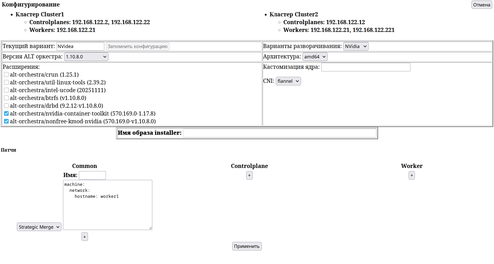

Описание страницы `pages/clusters/factory.tsx`

```
http://localhost:3000/factory
```
и REST-интерфейса по URL:

```
http://localhost:5000/factory
```
Номера портов параметризируется.

Обращение к странице `pages/clusters/factory.tsx` по URL `
http://localhost:3000/maestro/factory` со страницы `
http://localhost:3000/maestro/`  проходит через запрос `POST`. В теле запроса 
запроса передает JSON-структура формата:

```
{
  "Clusters": {
    "Cluster1": {
      "controlplane": [
        "192.168.122.12"
      ],
      "worker": [
        "192.168.122.13"
      ]
    },
    "Cluster2": {
      "controlplane": [
        "192.168.122.14"
      ],
      "worker": [
        "192.168.122.14"
      ]
    }
  },
  "deploymentVariant": "NVidia"
}
```
Страница делает REST-запрос по URL:

```
http://localhost:5000/deploymentsVariants

В ответ возвращается в формате JSON:

- список текущих вариантов разворачивания (`deploymentsVariants`)
- список версий ALT оркестра (`versions`)
- список schematics (`schematics`)
- список CNI (`cni`);
- список патчей : `patches `  по типам `common`, `controlplane`, `worker`

Например:
```
{
  "deploymentsVariants": [
    {
      "default": {
        "version": "1.10.8.0",
        "schematicId": "376567988ad370138ad8b2698212367b8edcb69b5fd68c80be1f2ec7d603b4ba",
        "cni": "flannel:v0.27.3"
      }
    },
    {
      "NVidia": {
        "version": "1.10.8.0",
        "schematicId": "75102a21bfd618eb6ad53f06d5a27b6a3c03c8d108f2c72f1bbaf8dec328f1f5",
        "cni": "cilium:1.18.2"
      }
    }
  ],
  "versions": [
    {
      "1.1": [
        "1.10.8.0",
        "1.10.7.0"
      ]
    },
    {
      "1.11-pre": [
        "1.11.6.0-alpha.1",
        "1.11.6.0-alpha.0"
      ]
    }
  ],
  "schematics": [
    {
      "376567988ad370138ad8b2698212367b8edcb69b5fd68c80be1f2ec7d603b4ba": {
        "customization": {},
        "image": "altlinux.space/alt-orchestra/installer:v1.10.6",
        "patches": {
          "common": ["setHostname.yaml"]
        }
      }
    },
    {
      "75102a21bfd618eb6ad53f06d5a27b6a3c03c8d108f2c72f1bbaf8dec328f1f5": {
        "customization": {
          "systemExtensions": {
            "officialExtensions": [
              "alt-orchestra/nonfree-kmod-nvidia",
              "alt-orchestra/nvidia-container-toolkit"
            ]
          }
        },
        "patches": {
          "worker": ["tuneNVidiaCard.json"]
        }
      }
    }
  ],
  "cni": [
    {
      "flannel": [
        "v0.27.3",
        "v0.27.0",
        "v0.25.1"
      ]
    },
    {
      "cilium": [
        "1.18.2"
      ]
    }
  ],
  "patches": {
    "common": [],
    "controlplane": [],
    "worker": []
  }
}

```
На странице `pages/clusters/factory.tsx`

```
http://localhost:3000/factory
```


отображаются:

- Кнопка "Отмена" для возврата на предыдущую страницу
- Поле Select "Варианты разворачивания"
- Input полу "Имя варианта разворачивания"
- Поле Select для выбора версий ALT Orchestra (см 
  [https://factory.altlinux.space/?platform=metal\&target=metal](https://factory.altlinux.space/?platform=metal&target=metal)
  )
- Поле Select для выбора архитектуры (amd64, arm64) (см 
  [https://factory.altlinux.space/?platform=metal\&target=metal&version=1.10.8.0](https://factory.altlinux.space/?platform=metal&target=metal&version=1.10.8.0)
  )
- Поле Extensions для выбора набора расширений (см 
  [https://factory.altlinux.space/?arch=amd64\&platform=metal&target=metal&version=1.10.8.0](https://factory.altlinux.space/?arch=amd64&platform=metal&target=metal&version=1.10.8.0)
  )
- Поле Customization для указания параметров вызова ядра (см
  https://factory.altlinux.space/?arch=amd64\&extensions=-&platform=metal&target
  metal&version=1.10.8.0)
- Поле Select для выбора CNI

В конце отображаются три секции для добавления патч файлов:

- `common` \- патчи применимые для файлов `controlplane.yaml`, `worker.yaml`
- `controlplane` \- патчи применимые для файла `controlplane.yaml`
- `worker` \- - патчи применимые для файла ` worker.yaml`

Для передачи запроса на странице присутствует кнопка `Apply`.

В каждой секции отображается кнопка `\+` для добавления патчей для указанной
секции. Описание патчей может быть в yaml или json формате (см 
<https://docs.siderolabs.com/talos/v1.9/configure-your-talos-cluster/system-configuration/patching>
) Проверять корректность заполнения в React коде будет наверно затруднительно.
Там что корректность возможно будем проверять при вызове REST интерфейса

```
http://localhost:5000/factory
```
по окончании заполнения всех полей. Интерфейс может вернуть коды ошибок в
которых указываются строки и позиции встреченных ошибок, Еще желательно было бы
для каждого patch'а вводить его имя и добавить возможность выбирать содержимое
уже введенных до этого патчей.

Если параметр `deploymentVariant` не указывается по умолчанию отображается
вариант `default` со стандартными значениями полей:

- список версий ALT оркестра - максимальная версия
- schematics - 376567988ad370138ad8b2698212367b8edcb69b5fd68c80be1f2ec7d603b4ba
- cni - последняя версия flannel

Если пользователь меняет хотя бы одно поле, то поле `Вариант разворачивания`
становится пустым и пользователь до передачи запроса должен ввести уникальное
имя этого поля.

При нажатии кнопки `Apply` через запрос POST передаются введенные значения по
URL  `http://localhost:5000/apply`.

