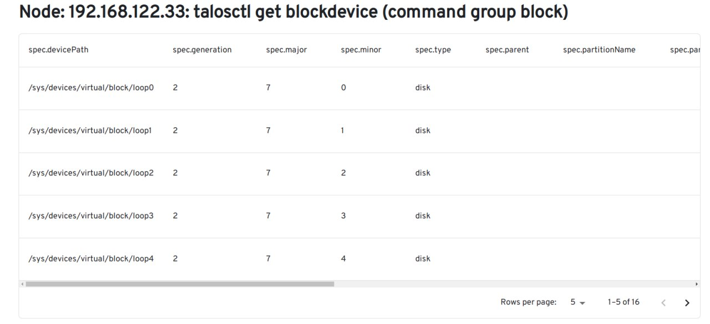

# maestro

headlamp-плугин maestro поддерживает UI-интерфейс к команде talosctl и:
- добавляет к headlamp набор WEB-страниц (UI-интерфейсы) для работы с kubetnetes развернутым под ОС ALTOrchestra/Talos;
- модифицирует основной интерфейс headlamp, добавляя на него ссылки на WEB-страницы maestro или дополняя страницы информацией, полученных от команды talosctl.

Плугин поддерживает множество кластеров и позволяет:
- создавать и модифицировать (добавлять/удалять/перемещать узлы) kubernetes-кластеры;
- отображать данные узлов кластера (набор устройств, партиций, ...) см [Запрос ресурсов talosctl get](../../usefullSubcommands.md);
- работать с etcd и другими сервисами кластера (си. [Полезные команды talosctl](../../usefullCommands.md)).

## Схема работы headlamp-плугина maestro

Так как headlamp-плугин maestro не может напрямую обращаться к talosctl создает [REST-интерфейс](../../api/flaskAPI.py) для:
- сканирования сети для получения списка узлов, развернутых под ОС ALTOrchestra/Talos;
- обращения к talosctl для получения необходимой информации, подключению узлов к ALTOrchestra/Talos кластерам или создания новых кластеров.

## Главная страница 

При обращении к корневоя странице плугина через [REST-интерфейс](../../api/flaskAPI.py) производится сканирования указанной сети (в данном случае 192.168.122.0/24) для получения списка узлов, имеющих открытый порт 50000 (GRPC интерфейс ALT Orchestra сервиса APID).

Полученный список сверяется cо списком endpoint и node узлов. полученными из файла конфигурации `talosconfig` командой [talosctl config contexts](../../api/flaskAPI.py#L50) и:
- формируется дерево узлов принадлжащим текущим клстерам c с разбивкой на controlplane (enpoint) и worker узлы;
- узлы не принадлежащие ни к одному из узлов помещаются в виртуальный кластер `NULL`.
Полученный список отображается в UI-интерфейсе.

Для узлов, помещенных в вируальный кластер `NULL` возможны следующие действия:
- если узел уже развернут помешение их в существующие кластера (endpoint или node в файле конфигурации talosconfig);
- если узел находится в стадии разворачивания (начальный загрузка) добавление их в уже существующий кластер или создание нового кластера.

Для узлов принадлежащих кластерам возможно:
- отображение из данных полученных командой `talosctl get`. Дерево команд приведено в файле [RDTree.yaml](../../RDTree.yaml);
- поддержка остальных команд `talosctl`. Список команд с подкомандами приведен в [talosctl cli](https://docs.siderolabs.com/talos/v1.7/reference/cli).

## Страницы отображения данных узла

Ниже приведены 

для примера два UI-интерфейса отображения данных выбранного узла, полученных через REST-интерфейс командой `talosctl get` для controlplane узла `192.168.122.33`:

- `talosctl get blockdevice` (группа команд block)

;

- `talosctl get devices` (группа команд hardware)

Интерфейс поддерживает:

- установку числа отображаемых строк на странице;
- сортировку строк по убыванию или возрастанию по любому столбцу .

Столбцы входящие в группу `spec` JSON-вывода команды `talosctl get` отображаются с префиксом `spec.`. Столбцы входящие в группу `metadata` с префиксом `meta`. 
Смотри пример вывода команды 
[talosctl get blockdevice](./src/get/block/blockdevice/Data.json).

<!--This is the default template README for [Headlamp Plugins](https://github.com/kubernetes-sigs/headlamp).

- The description of your plugin should go here.
- You should also edit the package.json file meta data (like name and description).

## Developing Headlamp plugins

For more information on developing Headlamp plugins, please refer to:

- [Getting Started](https://headlamp.dev/docs/latest/development/plugins/), How to create a new Headlamp plugin.
- [API Reference](https://headlamp.dev/docs/latest/development/api/), API documentation for what you can do
- [UI Component Storybook](https://headlamp.dev/docs/latest/development/frontend/#storybook), pre-existing components you can use when creating your plugin.
- [Plugin Examples](https://github.com/kubernetes-sigs/headlamp/tree/main/plugins/examples), Example plugins you can look at to see how it's done.
-->