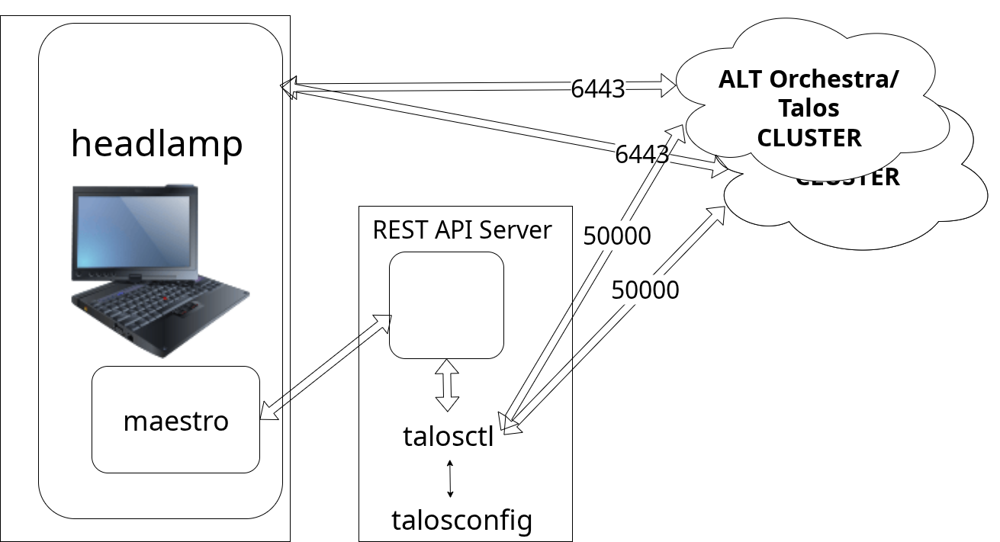
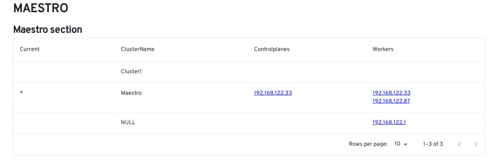
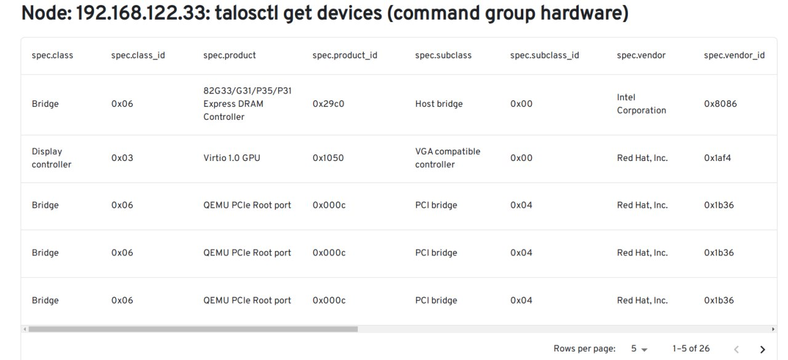

# headlamp-плугин  maestro

headlamp-плугин maestro поддерживает UI-интерфейс к команде talosctl и:
- добавляет к headlamp набор WEB-страниц (UI-интерфейсы) для работы с kubetnetes развернутым под ОС ALTOrchestra/Talos;
- модифицирует основной интерфейс headlamp, добавляя на него ссылки на WEB-страницы maestro или дополняя страницы информацией, полученных от команды talosctl.

Плугин поддерживает множество кластеров и позволяет:
- создавать и модифицировать (добавлять/удалять/перемещать узлы) kubernetes-кластеры;
- отображать данные узлов кластера (набор устройств, партиций, ...) см [Запрос ресурсов talosctl get](../../usefullSubcommands.md);
- работать с etcd и другими сервисами кластера (см. [Полезные команды talosctl](../../usefullCommands.md)).

## Запуск

Плагин состоит из двух компонентов: **API-сервера** (Python) и **frontend-плагина** (Headlamp). Оба должны быть запущены одновременно.

### Требования

- Python 3.11+
- Node.js / npm
- `talosctl`, `nmap` (системные утилиты)
- Запущенный [headlamp](https://github.com/kubernetes-sigs/headlamp)

### 1. API-сервер

Установка зависимостей:

```bash
cd api
./scripts/install.sh
```

Или вручную:

```bash
cd api
python3 -m venv .venv
source .venv/bin/activate
pip install -U pip
pip install -r requirements.txt
```

Настройка (опционально): скопируйте `api/env.example` в `api/.env` и задайте нужные значения.

Запуск:

```bash
cd api
./scripts/start.sh
```

Или напрямую:

```bash
cd api
python3 run.py
```

API по умолчанию доступен на `http://127.0.0.1:5000`.

### 2. Frontend-плагин (режим разработки)

Установка зависимостей:

```bash
cd plugin/maestro
npm install
```

Запуск dev-сервера:

```bash
npm start
```

Headlamp подхватит плагин автоматически, если запущен в режиме разработки.

### 3. Сборка и деплой плагина

```bash
cd plugin/maestro
npm run build
```

Скопируйте папку `plugin/maestro/dist/` в директорию плагинов headlamp:

```bash
mkdir -p ~/.config/headlamp/plugins/maestro
cp -r dist/* ~/.config/headlamp/plugins/maestro/
```

## Схема работы headlamp-плугина maestro

Так как headlamp-плугин maestro не может напрямую обращаться к talosctl для его функционирания создан [REST-интерфейс](../../api/run.py) для:
- сканирования сети для получения списка узлов, развернутых под ОС ALTOrchestra/Talos;
- обращения к talosctl для получения необходимой информации, подключению узлов к ALTOrchestra/Talos кластерам или создания новых кластеров.



## Главная страница 

При обращении к корневой странице плугина через [REST-интерфейс](../../api/app/routes/nodes_tree.py) производится сканирования указанной сети (в данном случае 192.168.122.0/24) для получения списка узлов, имеющих открытый порт 50000 (GRPC интерфейс ALT Orchestra/Talos сервиса APID).

Полученный список сверяется cо списком endpoint и node узлов. полученными из файла конфигурации `talosconfig` командой [talosctl config contexts](../../api/maestro.py) и:
- формируется дерево узлов принадлежащих текущим кластерам c разбивкой на controlplane (enpoint) и worker узлы;
- узлы не принадлежащие ни к одному из узлов помещаются в виртуальный кластер `NULL`.
Полученный список отображается в UI-интерфейсе.



Для узлов, помещенных в виртуальный кластер `NULL` возможны следующие действия:
- если узел уже развернут и входит в кластер, но отсутствует в качестве endpoint или node  в файле конфигурации `talosconfig` - добавление его в talosconfig в качестве endpoint или node (при "ручном" разворачивании часто эта информация отсутствует в `talosconfig`);
- если узел находится в стадии разворачивания (начальный загрузка) - добавление его в уже существующий кластер или во вновь создаваемый.

Для узлов принадлежащих кластерам возможно:
- Отображение данных полученных командой `talosctl get`. Дерево поддерживаемых подкоманд команды `talosctl get` приведено в файле [RDTree.yaml](../../RDTree.yaml);
- Поддержка остальных команд `talosctl`. Список команд с подкомандами приведен в описании команд и подкоманд команды [talosctl cli](https://docs.siderolabs.com/talos/v1.7/reference/cli).

## Страницы отображения данных узла

Ниже приведены в качестве примера два UI-интерфейса отображения данных выбранного узла, полученных через REST-интерфейс командой `talosctl get` для `controlplane` узла `192.168.122.33`:

- `talosctl get blockdevice` (группа команд block)

;

- `talosctl get devices` (группа команд hardware)



Интерфейс поддерживает:

- установку числа отображаемых строк на странице;
- сортировку строк по убыванию или возрастанию по любому столбцу .

Столбцы входящие в группу `spec` JSON-вывода команды `talosctl get` отображаются с префиксом `spec.`. 
Столбцы входящие в группу `metadata` - с префиксом `meta`. 
См. пример вывода команды 
[talosctl get blockdevice](./src/get/block/blockdevice/Data.json).


## Работа с etcd и другими сервисами кластера

В разработке...


## Ссылки

- [headlamp github](https://github.com/kubernetes-sigs/headlamp);
- [headlamp Docs](https://github.com/kubernetes-sigs/headlamp/tree/main/docs);
- [install](https://github.com/kubernetes-sigs/headlamp/blob/main/docs/development/index.md);
- [headlamp Development](https://headlamp.dev/docs/latest/development/).
